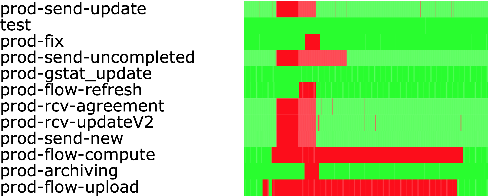

# Jobber History to Svg 

This tool allow you to see your jobs status in one glance, from a 10000 lines files to a simple svg

## Usage

Command argument :

- `in` : the log file to analyse
- `out` : where to store the result
- `min` : number of log line wanted by job
- `hour` : minimal period that should be covered in the svg on hour (per job)


Example : 

```bash
jobber-history  -in .jobber/log/history.log -out /var/www/public_html/jobber.svg -min 20 -hour 72
```

Result : 




I plan to merge this into the jobber source code directly